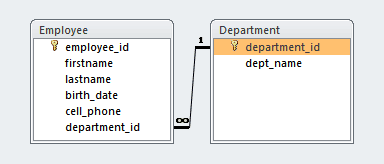
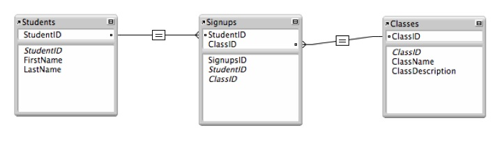

#What's the difference between *select_related* and *prefetch_related* in Django?  

####select_related  
1. only takes one query  
2. select_related does a SQL join which happens in the database  

####prefetch_related  
1. executes two queries  
2. then the results will be 'joined' by the ORM

#When do we use one over the other?  

####select_related  
> Use *select_related* when the object that you're going to be selecting is a single object, which means a One-To-One Field or a Foreign Key  

One-to-One Relationship:  
  

####prefetch_related  
> Use *prefetch_related* when you're going to get a "set" of things, which entails Many-To-Many Fields or reverse ForeignKeys  

Many-to-Many Relationship:  
  

#####*Sources:*  
<http://stackoverflow.com/questions/31237042/whats-the-difference-between-select-related-and-prefetch-related-in-django-orm>  